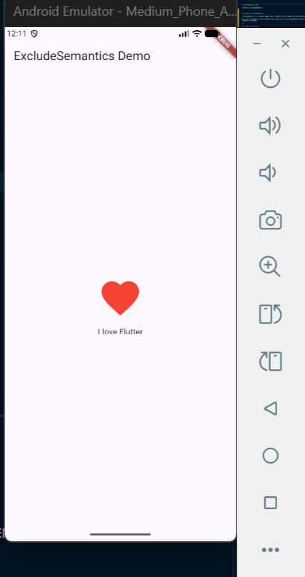

# ExcludeSemantics Demo

**Widget:** ExcludeSemantics  

---

## 🧠 What is ExcludeSemantics?

`ExcludeSemantics` is a Flutter widget used to remove its child widget from the accessibility tree.

This means the widget is still visible on the screen, but it will be ignored by screen readers like TalkBack or VoiceOver.

---

## 💡 Why is it useful?

In real-world applications, some UI elements are only decorative (like icons or images).  
Using `ExcludeSemantics` prevents accessibility tools from reading unnecessary or confusing information.

---

## 🎬 Demo Explanation (Before → After)

This demo shows a simple example:

- **Before:**  
  A heart icon is displayed and is accessible to screen readers.

- **After:**  
  The same heart icon is wrapped with `ExcludeSemantics`.  
  It still appears on the screen, but it is ignored by accessibility tools.

---

## ▶️ How to Run the Project

1. Clone the repository:

git clone https://github.com/benigne811/exclude_semantics_demo.git

2. Open the project in VS Code

3. Run the following commands:

flutter pub get
flutter run

## 🖼️ Screenshot

---

## 🎥 Demo Video

[Watch Demo Video]( https://screenrec.com/share/4lrIEDe9vo )
